# 📺 IPTV TUI

A fast, feature-rich terminal UI for browsing, searching, and playing IPTV playlists. Built in Rust with [ratatui](https://github.com/ratatui/ratatui).

Handles playlists with **1,000,000+ channels** — loads in seconds, searches instantly.


## ✨ Highlights

- **Blazing fast** — 1M+ channel playlists load in seconds, fuzzy search returns results instantly
- **HDHomeRun emulation** — plug directly into Plex or Jellyfin as a tuner device
- **DVR recording** — schedule recordings with persistence across restarts
- **EPG program guide** — full grid view with time-proportional programme blocks
- **Series browser** — tree view with automatic season/episode deduplication
- **6 built-in themes** — default, catppuccin, dracula, nord, gruvbox, solarized
- **Disk caching** — instant startup, background refresh
- **Zero config** — point at an M3U and go

## Screenshots

### EPG Program Guide
Full grid view with channel list, time-proportional programme blocks, and current time marker.

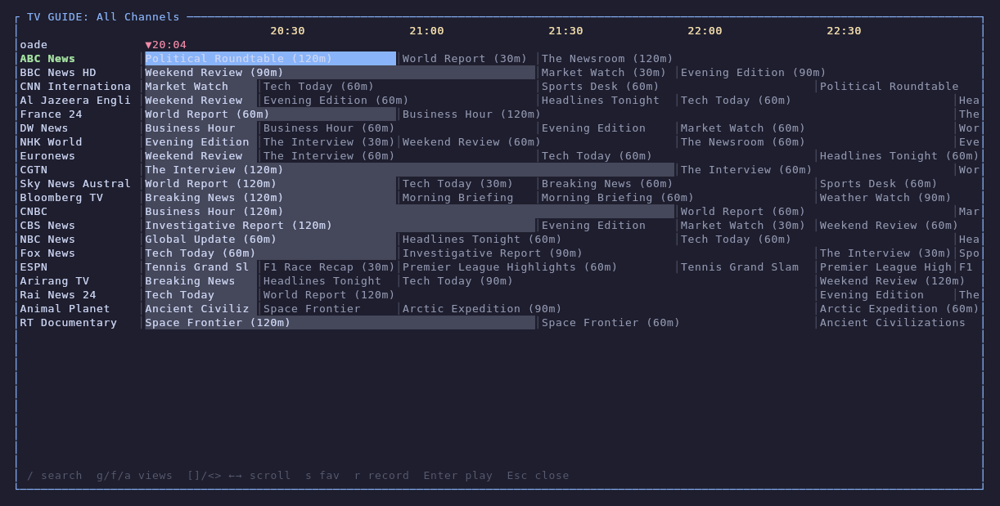

### Fuzzy Search
Powered by [nucleo](https://github.com/helix-editor/nucleo) (same engine as Helix editor). Search across 10,000+ channels instantly.

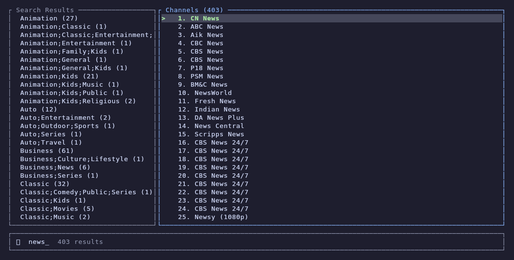

### Series Browser
Tree view with collapsible seasons, episode deduplication, and batch downloads.

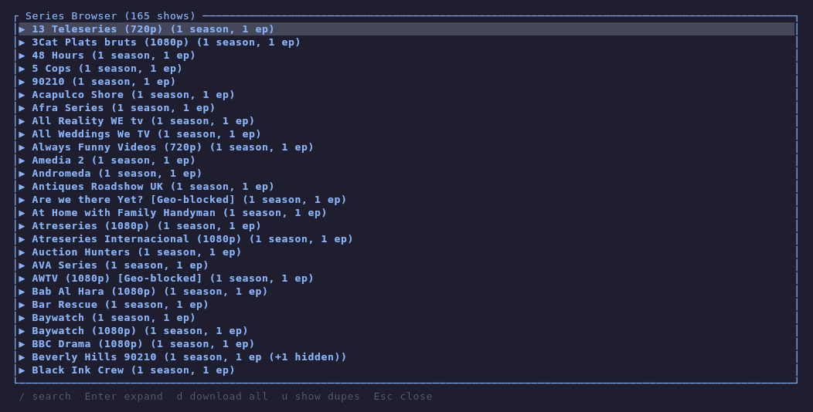

### Source Info
View playlist and EPG metadata, cache status, and trigger manual refreshes.

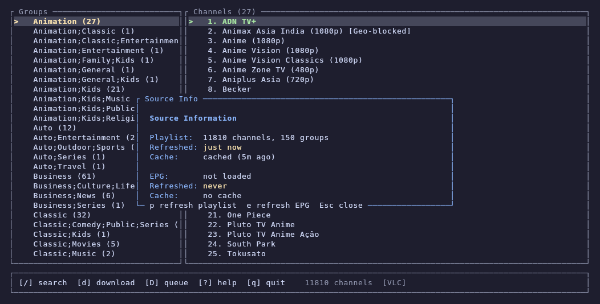

### Download Queue
Background downloads with progress bars, speed display, and batch support.

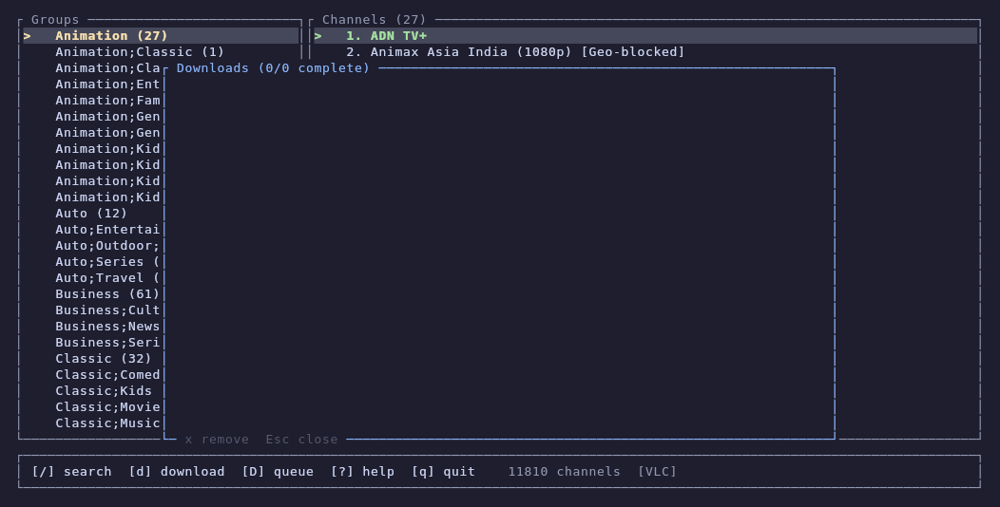

### DVR Recordings
Schedule and manage recordings with persistence across restarts.

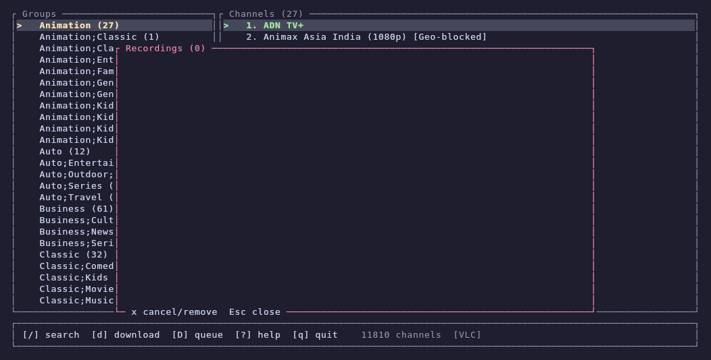

### Log Viewer
Color-coded application and player logs with scroll support.

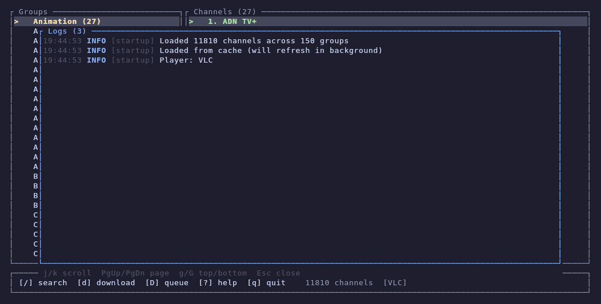

### Timezone Selector
Searchable timezone picker for EPG time display.

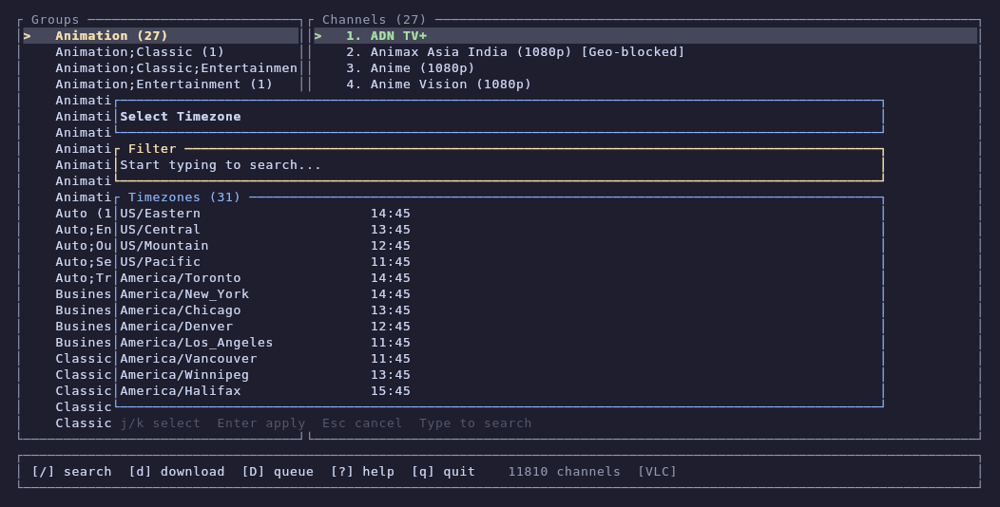

### Themes

Press `t` to cycle through 6 built-in color themes. Selection persists across sessions.

| Default | Catppuccin | Dracula |
|---------|------------|---------|
| 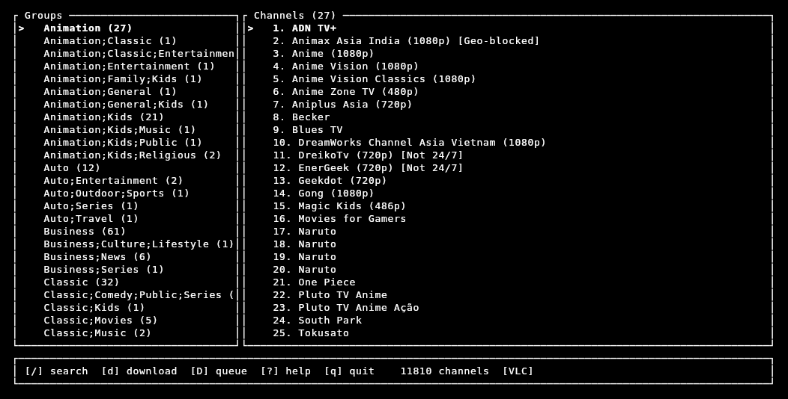 | 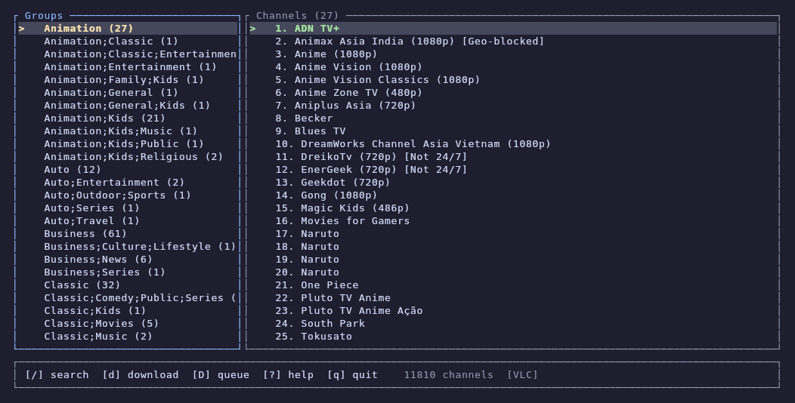 | 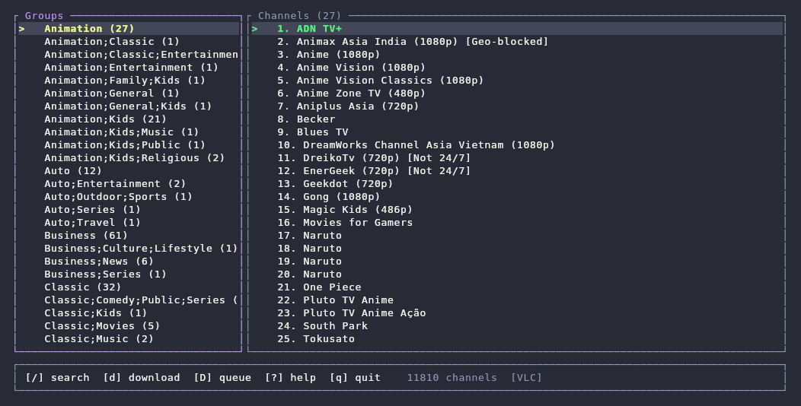 |

| Nord | Gruvbox | Solarized |
|------|---------|-----------|
| 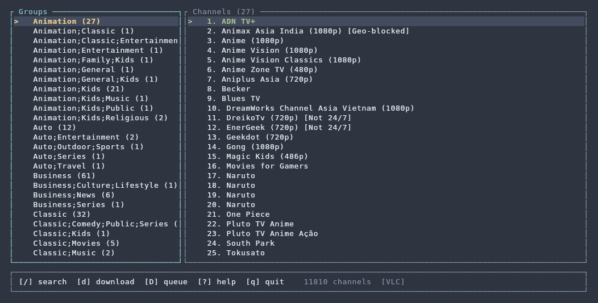 | 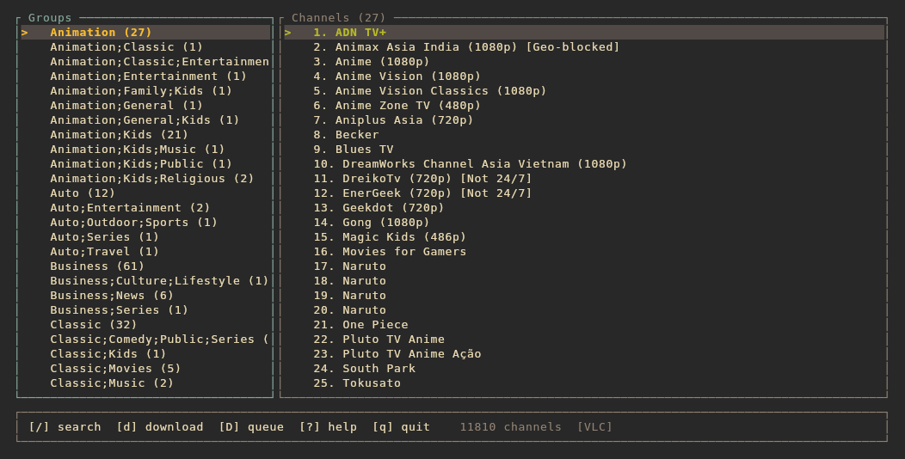 | 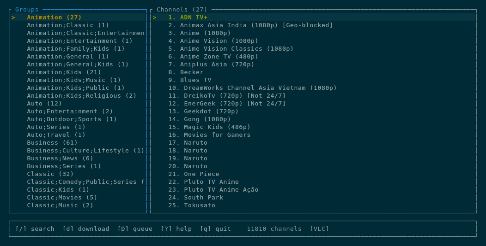 |

## Features

### 📡 Playlist Sources
- **M3U files** — local `.m3u` / `.m3u8` playlists
- **M3U URLs** — remote playlists fetched over HTTP (streamed for large files)
- **Xtream Codes API** — connect to Xtream-compatible IPTV providers with server/user/pass

### 🔍 Search & Navigation
- **Fuzzy search** — instant results powered by nucleo
- **Group browsing** — channels organized by category with group selector
- **EPG guide** — full program guide with grid view, now/next display, and search
- **Series browser** — tree view with season/episode hierarchy and automatic deduplication
- **Source info panel** — view playlist metadata, cache status, trigger refreshes

### ⭐ Favorites & Tuner Integration
- Star/unstar channels from any view
- Dedicated favorites filter
- **Drives your HDHomeRun tuner** — favorited channels automatically appear in Plex/Jellyfin
- Changes picked up instantly, no restart needed
- Persisted to `~/.config/iptv/favorites.json`

### 📥 Downloads
- **Download queue** — background downloads with concurrent worker
- **Batch downloads** — download entire series seasons with one key (`Ctrl+d`)
- **Progress tracking** — real-time speed and progress display
- **Smart dedup** — batch downloads automatically skip duplicate episodes

### 🎬 DVR Recording
- **Scheduled recording** — set start/end times for future recordings
- **Instant recording** — start recording now with configurable duration
- **Recording manager** — view active, scheduled, completed, and failed recordings
- **Persistence** — recording schedule survives app restarts; interrupted recordings auto-resume
- Output saved to `~/Downloads/iptv/recordings/`

### 📡 HDHomeRun Tuner Emulation
- **Plex/Jellyfin integration** — exposes channels as an HDHomeRun-compatible tuner device
- **Stream proxy** — proxies streams with proper headers (no broken 302 redirects)
- **Pre-roll buffer** — configurable buffer delay for smooth playback
- **XMLTV endpoint** — serves EPG data at `/xmltv.xml` for guide integration
- **M3U endpoint** — curated playlist at `/playlist.m3u`
- **ffmpeg transcoding** — optional buffer mode for stream normalization

### 🔄 Auto-Refresh
- **Background playlist + EPG refresh** — periodically re-fetches both without interrupting browsing
- **Manual refresh** — trigger immediate refresh from source info panel
- **Configurable interval** — set refresh frequency via `--refresh-hours`

### 💾 Disk Caching
- **Instant startup** — loads from cache on launch, refreshes in background
- **Playlist + EPG cached** — both stored in `~/.config/iptv/cache/`
- **Staleness detection** — auto-refreshes if cache is older than 24 hours

### 🎨 Themes
- **6 built-in themes** — default, catppuccin, dracula, nord, gruvbox, solarized
- **Semantic color system** — 13 color roles (accent, text, highlight, success, error, etc.)
- **Instant switching** — press `t` to cycle themes
- **Persisted** — selection saved to `~/.config/iptv/theme.json`

### 🎮 Playback
- **Player selector** — switch between VLC and mpv with `P`
- Current player shown in status bar
- Player stdout/stderr captured cleanly — no log spam corrupting the TUI

### 📋 Log Viewer
- **Full app log** — press `L` to view all application and player logs
- **Color-coded levels** — INFO, WARN, ERR, PLAY with timestamps
- **Scrollable** — `j`/`k`, PgUp/PgDn, `g`/`G` for top/bottom
- **Auto-flush** — logs flush to `~/.config/iptv/logs/` at 10MB

## Installation

### Quick Install

```bash
cargo install --git https://github.com/nschnarr/iptv-tui-player.git
```

### From Source

```bash
# Requires Rust 1.75+
git clone https://github.com/nschnarr/iptv-tui-player.git
cd iptv-tui-player
cargo build --release
# Binary at target/release/iptv
```

## Usage

### Quick Start (No Subscription Required)

Try it immediately with free, publicly available channels from [iptv-org/iptv](https://github.com/iptv-org/iptv):

```bash
# All public channels worldwide (~10,000+)
iptv --url "https://iptv-org.github.io/iptv/index.m3u"

# By country
iptv --url "https://iptv-org.github.io/iptv/countries/us.m3u"
iptv --url "https://iptv-org.github.io/iptv/countries/ca.m3u"

# By category
iptv --url "https://iptv-org.github.io/iptv/categories/news.m3u"
iptv --url "https://iptv-org.github.io/iptv/categories/sports.m3u"

# By language
iptv --url "https://iptv-org.github.io/iptv/languages/eng.m3u"
```

> Browse all available playlists at [iptv-org/iptv](https://github.com/iptv-org/iptv/blob/master/PLAYLISTS.md)

### Basic

```bash
# Local M3U file
iptv --playlist /path/to/playlist.m3u

# Remote M3U URL
iptv --url "https://your-provider.com/playlist.m3u"

# Xtream Codes provider
iptv --xtream-server "http://provider.com:8080" --xtream-user myuser --xtream-pass mypass
```

### With EPG Guide

```bash
iptv --url "https://your-provider.com/playlist.m3u" --epg "https://your-provider.com/epg.xml"
```

### HDHomeRun Mode (for Plex/Jellyfin)

```bash
iptv --url "https://your-provider.com/playlist.m3u" \
     --epg "https://your-provider.com/epg.xml" \
     --hdhr-port 5004 \
     --buffer ffmpeg \
     --hdhr-buffer-secs 3
```

Then in Plex: **Settings → Live TV & DVR → Set Up** → enter `http://<your-ip>:5004` as the tuner URL, and `http://<your-ip>:5004/xmltv.xml` as the guide source.

Your curated playlist is also available at `http://<your-ip>:5004/playlist.m3u` for use with any M3U-compatible player.

### Auto-Refresh

```bash
# Refresh playlist + EPG every 6 hours
iptv --url "https://your-provider.com/playlist.m3u" \
     --epg "https://your-provider.com/epg.xml" \
     --refresh-hours 6
```

## CLI Reference

```
Usage: iptv [OPTIONS]
```

### Playlist Source (one required)

| Flag | Description |
|------|-------------|
| `-p, --playlist <path>` | Path to a local M3U/M3U8 playlist file |
| `-u, --url <url>` | URL to a remote M3U playlist |
| `--xtream-server <url>` | Xtream Codes server URL (e.g. `http://provider.com:8080`) |
| `--xtream-user <username>` | Xtream Codes username |
| `--xtream-pass <password>` | Xtream Codes password |

### EPG

| Flag | Description |
|------|-------------|
| `-e, --epg <path_or_url>` | XMLTV EPG file path or URL |

### HDHomeRun Tuner

| Flag | Description |
|------|-------------|
| `--hdhr-port <port>` | Start HDHomeRun tuner server on this port (serves favorited channels) |
| `--hdhr-bind <addr>` | Bind address for HDHR server (default: `127.0.0.1`). Use `0.0.0.0` to allow LAN access (e.g. Plex on another machine) |
| `--buffer <none\|ffmpeg>` | Stream buffer mode (default: `none`). `ffmpeg` remuxes + buffers via FFmpeg for smoother playback |
| `--hdhr-buffer-secs <secs>` | Pre-roll buffer in seconds (default: `0`). Higher = slower channel changes, fewer pauses |

### Auto-Refresh

| Flag | Description |
|------|-------------|
| `--refresh-hours <hours>` | Re-fetch playlist + EPG every N hours (default: `0` = off) |

### Other

| Flag | Description |
|------|-------------|
| `-h, --help` | Show help |

## Key Bindings

| Key | Action |
|-----|--------|
| `↑` `↓` `j` `k` | Navigate channels |
| `←` `→` `h` `l` | Switch focus (groups ↔ channels) |
| `Enter` | Play selected channel |
| `/` | Fuzzy search |
| `Esc` | Close overlay / clear search |
| `s` / `Space` | Toggle favorite |
| `f` | Filter favorites only |
| `g` | Jump to top |
| `G` | EPG program guide |
| `S` | Series browser |
| `d` | Download selected |
| `Ctrl+d` | Batch download (series season) |
| `D` | Download queue |
| `r` | Record channel (60 min) |
| `R` | Recording manager |
| `i` | Source info panel |
| `P` | Switch player (VLC/mpv) |
| `L` | Log viewer |
| `t` | Cycle theme |
| `T` | Timezone selector |
| `?` | Help |
| `q` | Quit |

## Architecture

```
src/
├── main.rs        # CLI parsing, startup, event loop
├── app.rs         # Application state and logic
├── ui.rs          # ratatui rendering
├── theme.rs       # Color theme system (6 built-in themes)
├── parser.rs      # M3U/M3U8 streaming parser
├── model.rs       # Channel/playlist data model
├── search.rs      # Nucleo fuzzy search integration
├── epg.rs         # XMLTV parser and EPG data
├── epg_search.rs  # Async EPG programme search
├── series.rs      # Series tree builder
├── favorites.rs   # Favorites persistence
├── log.rs         # Application log buffer with disk flush
├── downloader.rs  # Download queue and worker
├── recorder.rs    # DVR recording scheduler
├── hdhr.rs        # HDHomeRun tuner server + stream proxy
├── xtream.rs      # Xtream Codes API client
├── provider.rs    # Playlist source abstraction
├── cache.rs       # Disk caching layer
├── player.rs      # External player launcher
├── timezone.rs    # Timezone selection and persistence
└── error.rs       # Error types
```

## Configuration

All config is stored in `~/.config/iptv/`:

| File | Purpose |
|------|---------|
| `favorites.json` | Starred channels |
| `recordings.json` | DVR recording schedule and state |
| `theme.json` | Selected color theme |
| `timezone.json` | Timezone preference |
| `cache/playlist.m3u` | Cached playlist for instant startup |
| `cache/epg.xml` | Cached EPG data |
| `logs/` | Application logs (auto-flushed at 10MB) |

Downloads: `~/Downloads/iptv/` · Recordings: `~/Downloads/iptv/recordings/`

## Dependencies

- [ratatui](https://github.com/ratatui/ratatui) + [crossterm](https://github.com/crossterm-rs/crossterm) — terminal UI
- [nucleo](https://github.com/helix-editor/nucleo) — fuzzy search (from Helix editor)
- [tokio](https://github.com/tokio-rs/tokio) — async runtime
- [ureq](https://github.com/algesten/ureq) — HTTP client
- [quick-xml](https://github.com/tafia/quick-xml) — XMLTV/EPG parsing
- [chrono](https://github.com/chronotope/chrono) + [chrono-tz](https://github.com/chronotope/chrono-tz) — time handling
- [serde](https://github.com/serde-rs/serde) / serde_json — serialization

**Optional:** ffmpeg (HDHR transcoding buffer), VLC or mpv (playback)

## Contributing

Contributions are welcome! Whether it's bug reports, feature requests, or pull requests — all appreciated.

### Getting Started

1. Fork the repo and clone your fork
2. Create a feature branch: `git checkout -b feature/my-feature`
3. Make your changes and ensure they compile: `cargo build`
4. Run clippy: `cargo clippy -- -D warnings`
5. Commit with a descriptive message: `git commit -m "feat: add my feature"`
6. Push and open a PR against `main`

### Guidelines

- **Keep PRs focused** — one feature or fix per PR
- **Follow existing patterns** — look at how similar features are implemented
- **Test with real data** — try your changes with a large playlist (iptv-org works great)
- **No unsafe code** unless absolutely necessary and well-justified
- **Commit messages** — use conventional format: `feat:`, `fix:`, `refactor:`, `docs:`, etc.

### Ideas for Contribution

Check the [issues](https://github.com/nschnarr/iptv-tui-player/issues) for open tasks. Some areas that could use help:

- Multi-provider support (merge multiple playlists)
- TMDB metadata integration
- Watch history tracking
- Smart collections / auto-categorization
- Additional themes
- Platform-specific packaging (Homebrew, AUR, etc.)

## License

This project is licensed under the [MIT License](LICENSE).
